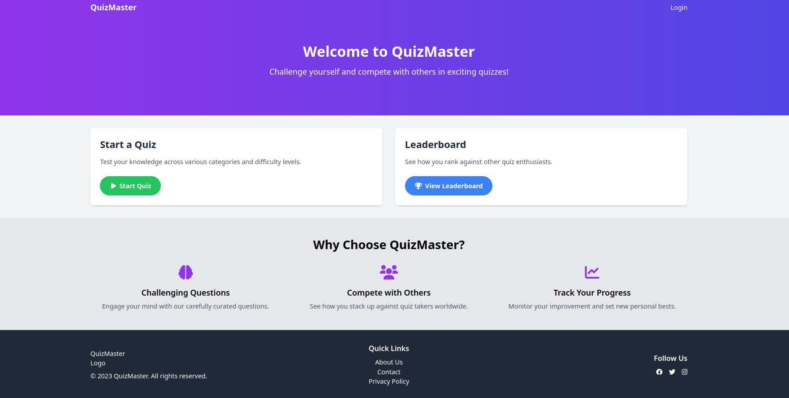
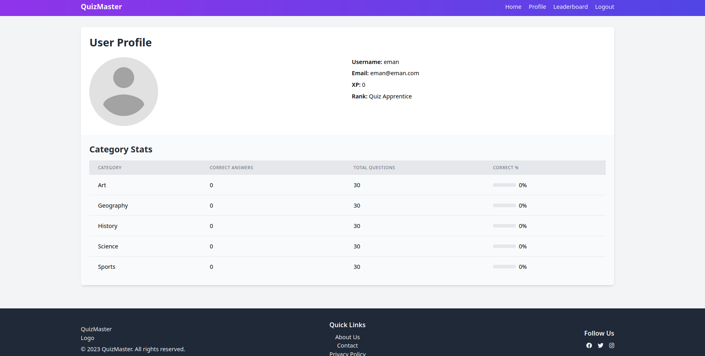
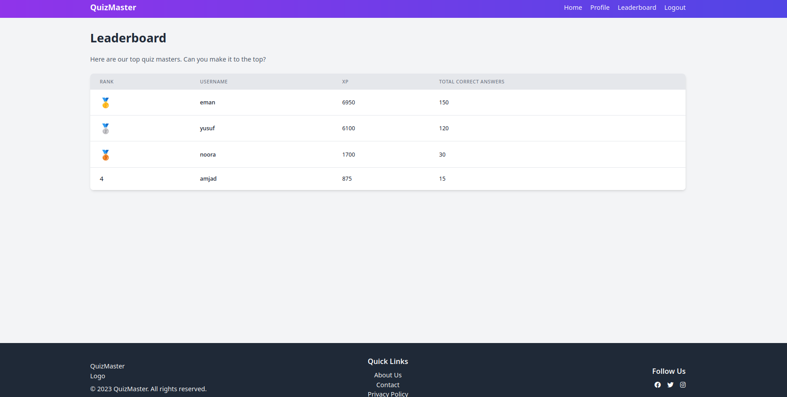

# QuizMaster - Laravel Project 🏆

This project demonstrates my ability to develop full-stack web applications using Laravel. QuizMaster is a quiz platform with user authentication, dynamic question handling, and leaderboard functionality.

## Features ✨

- 🔐 User authentication (Register/Login/Logout)
- 🧠 Quiz system with multiple categories
- 📊 XP system & player rankings
- 🏆 Leaderboard tracking top players
- 📈 User profile with detailed stats
- 🎯 Persistent quiz sessions

## Project Structure 📁
```plaintext
├── app/
│   ├── Http/Controllers/    # Laravel controllers
│   ├── Models/              # Database models
├── database/
│   ├── migrations/          # Database schema definitions
│   └── seeders/             # Data population
├── resources/
│   └── views/               # Blade templates
├── routes/                  # Web routes
└── tests/                   # Feature tests
```

## Technologies Used 🛠️

- **PHP 8.x** with **Laravel 11.x**
- **PostgreSQL** database
- **Blade** templating engine
- **Tailwind CSS** for styling
- **Vite** asset bundler

## Installation 💻

1. **Clone repository:**
    ```bash
    git clone https://github.com/emahfoodh/mister-quiz.git
    ```

2. **Install dependencies:**
    ```bash
    cd app
    composer install
    npm install
    ```

3. **Set up PostgreSQL using Docker:**

    **Pull the PostgreSQL Docker image:**
    ```bash
    docker pull postgres
    ```

    **Run the PostgreSQL container:**
    ```bash
    docker run --name my-postgres -e POSTGRES_PASSWORD=postgres -p 5432:5432 -d postgres
    ```

4. **Copy .env.example to .env:**
    ```bash
    cp .env.example .env
    ```

5. **Run migrations:**
    ```bash
    php artisan migrate
    ```

6. **Run the database seeder:**
    ```bash
    php artisan db:seed
    ```

7. **Start the development server:**
    ```bash
    php artisan serve
    ```

## Screenshots 📸

### Homepage

*Landing page with featured quizzes and user dashboard*

### Quiz Interface

*Interactive quiz interface with real-time feedback*

### Profile Interface

*User profile displaying detailed statistics and achievements*

### Leaderboard

*Global rankings and achievement showcase*


